# Product Requirements Document (PRD)
## Sistem Informasi Peta Resistensi Nyamuk dan Larva

| | |
|--|--|
| **Nama Sistem** | Sistem Informasi Peta Resistensi Nyamuk dan Larva |
| **Versi / Status** | 1.4 (mengikuti format template; keputusan peta dan hosting ditambahkan) / Draft untuk persetujuan |
| **Tanggal** | 5 Oktober 2026 |
| **Penyusun** | Bambang Wulung Mulangjoyo — Prakom Ahli Muda |
| **Instansi** | BBLKL (BB Labkesling Salatiga) |

---

## Ringkasan Sistem

BB Labkesling Salatiga membutuhkan sistem informasi terpadu untuk memantau **resistensi nyamuk (dewasa) dan larva terhadap insektisida/larvasida di seluruh Indonesia**. Sistem menampilkan peta interaktif sampai tingkat desa/kelurahan; saat pengguna memilih **spesies, insektisida, dan metode uji**, peta langsung menampilkan data yang sesuai. Sistem juga mengelola input data uji kerentanan dan data mutasi gen, verifikasi data, dokumentasi, serta laporan untuk pimpinan.

Pengguna: BBLKL, Balai Karantina Kesehatan, instansi lain, petugas instalasi, pengelola kegiatan, pimpinan, dan administrator.

Target: mengubah pencatatan manual dan komunikasi data yang tersebar di luar sistem menjadi **satu basis data terverifikasi**, dengan waktu dari data masuk sampai tampil di peta **maksimal 7 hari kerja**.

### Tujuan

- Peta resistensi interaktif seluruh Indonesia sampai desa/kelurahan (titik lokasi koleksi), dapat difilter menurut spesies, insektisida, dan metode uji.
- Memusatkan data uji kerentanan dan data mutasi gen resistensi dari BBLKL, Balai Karantina Kesehatan, dan instansi lain.
- Mengurangi pencatatan manual; semua data dan perubahan tercatat (audit trail).
- Dashboard dan laporan untuk pimpinan sebagai dasar keputusan pengendalian vektor.

### Indikator Keberhasilan (target awal, dikonfirmasi bersama pimpinan)

| Indikator | Target awal |
|-----------|-------------|
| Cakupan wilayah yang punya data resistensi terverifikasi | Dilaporkan per provinsi dan kabupaten/kota; target ditetapkan pimpinan |
| Waktu data masuk sampai terverifikasi dan tampil di peta | Maksimal 7 hari kerja |
| Persentase data baru yang masuk lewat sistem | 100% setelah masa transisi |
| Laporan rekap bulanan tanpa olah manual | Ya, sekali unduh |

### Ruang Lingkup

**Termasuk:** peta dan dashboard resistensi, master data, input dan verifikasi data uji kerentanan dan data mutasi, rekapitulasi dan ekspor, manajemen pengguna, audit trail, impor massal dari Excel/CSV.

**Di luar lingkup versi awal:** integrasi otomatis dengan sistem lain (SATUSEHAT, ASIK, dan sejenisnya), aplikasi mobile native, prediksi/pemodelan, stok insektisida, dan data kasus penyakit.

### Istilah Penting

| Istilah | Arti |
|---------|------|
| Resistensi | Kemampuan populasi nyamuk/larva bertahan terhadap dosis insektisida yang biasanya mematikan |
| Uji kerentanan (bioassay) | Uji pemaparan nyamuk/larva ke insektisida untuk mengukur kematian (mortalitas); contoh metode: WHO tube test, CDC bottle bioassay, uji larva WHO |
| Mutasi / marker molekuler | Perubahan gen yang berkaitan dengan resistensi, misalnya kdr (V1016G, F1534C, S989P) pada *Aedes aegypti*, atau Ace-1 G119S |
| Lokasi koleksi | Titik pengambilan sampel (desa/kelurahan, koordinat, tipe habitat) |
| Mortalitas terkoreksi | Persentase kematian setelah dikoreksi dengan kematian kontrol (rumus Abbott) |
| RR (resistance ratio) | Perbandingan LC50 populasi lapangan terhadap strain rujukan rentan (uji larva) |

---

## Arsitektur & Teknologi

### Stack Teknologi

| Komponen | Teknologi | Versi | Keterangan |
|----------|-----------|-------|------------|
| **Bahasa** | PHP | ≥ 8.3 | Versi minimum yang didukung Laravel 13 |
| **Framework** | [Laravel](https://laravel.com/) | v13 | Full-stack PHP framework |
| **Admin Panel** | [Filament](https://filamentphp.com/) | v5 | UI framework berbasis TALL Stack (Tailwind CSS, Alpine.js, Livewire, Laravel) |
| **Database** | PostgreSQL | ≥ 16 | RDBMS utama untuk seluruh data aplikasi |
| **Frontend** | TALL Stack | — | Tailwind CSS + Alpine.js + Livewire (bawaan Filament) |
| **Peta** | Leaflet + OpenStreetMap | — | Halaman kustom Filament; plugin `Leaflet.markercluster` untuk titik data (lihat Keputusan Peta) |
| **Grafik** | Chart.js / ECharts | — | Chart widget Filament atau halaman kustom |
| **Ekspor** | DomPDF, PhpSpreadsheet / Laravel Excel | — | Ekspor PDF dan Excel |

### Lingkungan Hosting (cPanel)

**Keputusan:** sistem berjalan di hosting cPanel yang ada, memakai **PHP 8.3** dan **PostgreSQL** (keduanya tersedia di cPanel), pada **subdomain khusus** (misalnya `resistensi.namadomain.go.id`) agar aplikasi lain di akun yang sama tidak terpengaruh.

| Aspek | Ketentuan |
|-------|-----------|
| Versi PHP | 8.3, diaktifkan khusus subdomain lewat MultiPHP Manager; **jangan mengubah versi bawaan seluruh akun** |
| Syarat yang harus dipastikan | Pengaturan versi PHP dapat dibuat per subdomain (bukan per akun). Bila hanya per akun (misalnya CloudLinux Select PHP Version), pakai akun cPanel terpisah atau minta hosting mengaktifkan PHP 8.3 khusus subdomain |
| Document root | `/home/USER/resistensi/public` (kode aplikasi di luar `public_html`) |
| Database | PostgreSQL dari menu *PostgreSQL Databases*; PostGIS dan `pg_trgm` opsional |
| Ekstensi PHP | `pdo_pgsql`, `pgsql`, `mbstring`, `xml`, `dom`, `curl`, `fileinfo`, `openssl`, `intl`, `zip`, `gd`, `exif`, `bcmath`, `opcache` |
| Antrean dan jadwal | Driver `database`; cron `schedule:run` dan `queue:work --stop-when-empty` tiap menit; tanpa proses permanen |
| Backup | Cron harian `pg_dump` dan backup folder upload |
| Detail langkah | Lihat `Panduan-Konfigurasi-cPanel-PHP83.md` |

### Keputusan Peta

**Disetujui:** pustaka peta **Leaflet** dengan peta dasar **OpenStreetMap (OSM)**.

| Aspek | Keputusan |
|-------|-----------|
| Pustaka | Leaflet, dipasang pada Filament Custom Page (Livewire + Alpine) |
| Plugin | `Leaflet.markercluster` untuk pengelompokan titik; `leaflet-heat` opsional untuk peta panas (fase berikutnya) |
| Peta dasar (tile) | OSM untuk pengembangan dan uji. **Untuk produksi, siapkan penyedia tile lain** (misalnya MapTiler atau Stadia, atau hosting tile sendiri) karena server tile OSM gratis punya kebijakan pemakaian wajar dan tidak ditujukan untuk lalu lintas produksi tinggi. URL tile disimpan di konfigurasi (`.env`) sehingga penggantian tidak mengubah kode |
| Atribusi | Atribusi OpenStreetMap dan penyedia tile ditampilkan pada peta |
| Batas wilayah | Poligon provinsi dan kabupaten/kota dimuat saat peta dibuka; poligon kecamatan dan desa dimuat saat drill-down per area yang terlihat. GeoJSON disederhanakan (simplified). Sumber data resmi (misalnya BIG, Kemendagri, atau BPS) dengan lisensi yang sudah dicek |
| Titik data | Lokasi koleksi dimuat lewat endpoint GeoJSON yang menerima filter (spesies, insektisida, metode, periode, wilayah, status) dan *bounding box* area yang terlihat |
| Alternatif bila lambat | MapLibre GL JS (vector tiles) dipertimbangkan di Fase 3 bila poligon sangat banyak membuat Leaflet terasa lambat |

### Arsitektur Database — PostgreSQL

> Gunakan PostgreSQL sebagai satu-satunya RDBMS. Manfaatkan fitur native berikut:

| Fitur PostgreSQL | Kegunaan dalam Sistem |
|------------------|-----------------------|
| **UUID** (`uuid` / `ulid`) | Primary key entitas utama (lokasi koleksi, uji kerentanan, uji mutasi, dokumen) |
| **JSONB** | Batas wilayah (GeoJSON), nilai konfigurasi ambang status, nilai lama/baru pada audit log |
| **Full-Text Search** (`tsvector`) | Pencarian cepat nama lokasi koleksi, wilayah, dan spesies |
| **Enum Types** | `status_data`, `status_resistensi`, `stadium`, `tingkat_wilayah`, `tipe_habitat` (lihat tabel di bawah) |
| **Partial Index** | Index pada `status_data = 'terpublikasi'` untuk query peta; index pada `deleted_at IS NULL` |
| **Foreign Key Constraints** | Integritas referensial antar tabel (lihat ER Diagram) |
| **Timestamp with Time Zone** | Konsistensi waktu (zona waktu WIB) |
| **PostGIS** (opsional) | Kolom `geometry(Point, 4326)` dan index GIST untuk kueri spasial, bila server mengizinkan; bila tidak, pakai kolom `latitude`/`longitude` |

**Enum yang dipakai:**

| Enum | Nilai |
|------|-------|
| `status_data` | `draft`, `diajukan`, `diverifikasi`, `terpublikasi`, `ditolak` |
| `status_resistensi` | `rentan`, `kemungkinan_resisten`, `resisten`, `resisten_sedang`, `resisten_tinggi`, `belum_cukup_data` |
| `stadium` | `dewasa`, `larva` |
| `tingkat_wilayah` | `provinsi`, `kabupaten_kota`, `kecamatan`, `desa` |
| `tipe_habitat` | `permukiman`, `pelabuhan`, `bandara`, `perkotaan`, `lainnya` |
| `peruntukan_insektisida` | `dewasa`, `larva`, `keduanya` |

### Struktur Panel Filament v5

| Panel | Path | Peran Pengguna | Deskripsi |
|-------|------|----------------|-----------|
| **Admin** | `/admin` | Super Admin, Admin, Verifikator, Petugas | Kelola master data, input data uji, verifikasi, manajemen pengguna, audit trail |
| **Pimpinan** | `/pimpinan` | Pimpinan / Direktur | Dashboard read-only, peta, laporan, dan statistik |
| **Portal Klien** | `/portal` | Klien (Balai Karantina Kesehatan dan instansi lain) | Input data lapangan milik instansi sendiri, cek status verifikasi, lihat peta dan dashboard |

### Komponen Filament v5 yang Digunakan

| Komponen | Fungsi |
|----------|--------|
| **Resources** | CRUD: Spesies, Insektisida, Metode, Wilayah, Lokasi Koleksi, Instansi, Uji Kerentanan, Uji Mutasi, Pengguna |
| **Relation Managers** | Replikasi dan konsentrasi pada Uji Kerentanan; baris marker pada Uji Mutasi; Dokumen; Riwayat Status |
| **Dashboard Widgets** | Stat widgets (jumlah lokasi, uji, % resisten) dan chart widgets (tren mortalitas, perbandingan insektisida, sebaran status) |
| **Actions & Modals** | Ajukan, setujui/tolak (alasan wajib), publikasikan, impor Excel/CSV, ekspor |
| **Notifications** | Notifikasi in-app saat data diajukan, ditolak, atau dipublikasikan |
| **Tables** | Tabel data dengan filter spesies, insektisida, metode, periode, wilayah, status; pencarian dan bulk actions |
| **Forms** | Form uji dengan validasi, kolom bersyarat (dewasa vs larva), dan file upload |
| **Infolists** | Detail uji (hasil, status, riwayat, lampiran) read-only |
| **Custom Pages** | **Peta Sebaran** (Leaflet + panel filter), halaman laporan dan ekspor |

---

## 1. Pengguna Sistem

| Peran | Siapa | Yang Mereka Lakukan | Panel Filament |
|-------|-------|---------------------|----------------|
| **Super Admin** | Pengelola sistem tingkat tertinggi | Akses semua data dan pengaturan, termasuk ambang status resistensi dan semua pengguna | Admin |
| **Admin** | Staf TI | Kelola pengguna dan master data | Admin |
| **Verifikator** | Penanggung jawab data / kepala instalasi | Memeriksa, menolak (dengan alasan), atau menyetujui data sebelum tampil di peta | Admin |
| **Petugas** | Staf instalasi | Input spesies, insektisida, metode, wilayah, serta data uji dan mutasi | Admin |
| **Klien** | Balai Karantina Kesehatan dan instansi lain | Mendaftar, input data lapangan milik instansinya, lihat dashboard | Portal Klien |
| **Pimpinan** | Kepala / Direktur | Lihat dashboard dan laporan — hanya baca | Pimpinan |

### Matriks Hak Akses

| Fitur | Super Admin | Admin | Verifikator | Petugas | Klien | Pimpinan |
|-------|:-----------:|:-----:|:-----------:|:-------:|:-----:|:--------:|
| Dashboard dan peta | Ya | Ya | Ya | Ya | Ya | Lihat |
| Master data | Ya | Ya | Lihat | Tambah/ubah | Lihat | Lihat |
| Input data uji dan mutasi | Ya | Ya | Lihat | Ya | Instansi sendiri | Lihat |
| Verifikasi dan publikasi | Ya | Ya | Ya | - | - | - |
| Ekspor dan laporan | Ya | Ya | Ya | Ya | Data sendiri | Ya |
| Kelola pengguna | Ya | Terbatas | - | - | - | - |
| Audit trail | Ya | Lihat | - | - | - | - |
| Pengaturan ambang status | Ya | - | - | - | - | - |

> Hak akses di atas adalah usulan dan perlu disahkan pemilik proses (lihat bagian 8, pertanyaan terbuka).

---

## 2. Layanan yang Dikelola Sistem

---

### Layanan A — Dashboard dan Peta Sebaran *(fitur utama)*

**Deskripsi:** Peta interaktif seluruh Indonesia yang menampilkan hasil uji resistensi nyamuk dan larva. Pengguna memilih spesies, insektisida, dan metode, lalu peta dan statistik langsung menyesuaikan.

**Alur:**
1. Pengguna login dan membuka halaman Peta Sebaran
2. Pengguna memilih filter: spesies, stadium, insektisida (dan golongan), metode, periode, wilayah, status resistensi
3. Peta hanya menampilkan titik/wilayah yang cocok; kartu ringkasan dan grafik ikut berubah
4. Pengguna mengklik penanda untuk melihat popup/panel detail (lokasi, spesies, insektisida, metode, tanggal uji, jumlah uji, mortalitas, status, instansi penguji, tautan ke data lengkap)
5. Pengguna melakukan drill-down (provinsi, kabupaten/kota, kecamatan, desa) atau membagikan URL tampilan
6. Pengguna mengunduh gambar peta bila perlu

**Data yang ditampilkan:** hasil uji kerentanan dan mutasi gen berstatus Terpublikasi · lokasi koleksi (koordinat) · agregat per wilayah

**Aturan bisnis:**
- Hanya data berstatus **Terpublikasi** yang tampil di peta dan statistik
- Warna penanda: **Rentan** = hijau; **Kemungkinan resisten** dan **Resisten sedang** = kuning; **Resisten** dan **Resisten tinggi** = merah; **Belum cukup data/tidak diuji** = abu-abu; legenda selalu tampil
- Bila satu lokasi, spesies, insektisida, dan metode punya beberapa uji pada periode filter, peta menampilkan **hasil uji terbaru**; riwayat tampil di panel detail
- Pada zoom jauh, titik dikelompokkan (cluster); titik dimuat berdasarkan area yang terlihat
- Lapisan data uji kerentanan dan data mutasi gen terpisah dan dapat dinyalakan/dimatikan
- Filter tersimpan di URL agar tampilan dapat dibagikan
- Pimpinan hanya dapat melihat (read-only)

---

### Layanan B — Master Data

**Deskripsi:** Pengelolaan data acuan yang dipakai oleh seluruh data uji.

**Alur:**
1. Admin/Petugas menambah atau mengubah data master
2. Data master yang sudah dipakai tidak dihapus, hanya dinonaktifkan
3. Data wilayah dimuat awal lewat seeder dari sumber resmi, lalu diperbarui bila ada pemekaran

**Data yang dicatat:**
- **Spesies** nyamuk dan larva: nama ilmiah (misal *Aedes aegypti*, *Aedes albopictus*, *Anopheles* spp., *Culex quinquefasciatus*), nama umum, genus, vektor penyakit, status aktif
- **Insektisida/larvasida:** nama, golongan (piretroid, organofosfat, karbamat, organoklorin, regulator pertumbuhan, biolarvasida), bahan aktif, peruntukan (dewasa/larva), konsentrasi diskriminasi rujukan
- **Metode:** nama (WHO tube test, CDC bottle bioassay, uji larva WHO, uji sinergis, PCR/sekuensing mutasi, uji enzim), jenis (kerentanan/molekuler/biokimia), stadium sasaran, rujukan pedoman
- **Wilayah:** provinsi sampai desa/kelurahan, kode wilayah resmi, hierarki, batas wilayah (GeoJSON), titik pusat
- **Lokasi koleksi:** nama lokasi, desa/kelurahan, alamat dusun, koordinat, tipe habitat, instansi pemilik
- **Instansi:** nama, jenis (BBLKL, balai karantina kesehatan, dinkes, dll.), alamat, kontak
- **Strain rujukan:** nama strain rentan (laboratorium) sebagai pembanding

**Aturan bisnis:**
- Unit wilayah resmi sampai **desa/kelurahan**. Tingkat RT/kampung dicapai lewat **titik koordinat** lokasi koleksi dan kolom alamat dusun, karena batas RT/kampung tidak tersedia seragam secara nasional
- Kode wilayah unik; nama spesies, insektisida, dan metode unik
- Data master tidak dihapus permanen (soft delete atau nonaktif)
- Insektisida wajib memiliki peruntukan (dewasa/larva/keduanya)

---

### Layanan C — Input Data

**Deskripsi:** Pencatatan hasil uji kerentanan (bioassay) dan data mutasi gen resistensi, lengkap dengan lampiran, verifikasi, dan riwayat status.

**Alur:**
1. Petugas atau Klien memilih lokasi koleksi (atau menambahkannya)
2. Mengisi form uji kerentanan atau uji mutasi; replikasi, konsentrasi, dan marker diisi sebagai baris terkait
3. Sistem menghitung mortalitas, mortalitas terkoreksi (Abbott), LC50/LC95/RR (larva), frekuensi alel, dan status resistensi
4. Data disimpan sebagai **Draft**, lalu **Diajukan**
5. Verifikator memeriksa: **Diverifikasi** atau **Ditolak** (alasan wajib; data kembali ke pengirim)
6. Setelah **Terpublikasi**, data tampil di peta dan statistik
7. Data yang sudah Terpublikasi lalu diubah kembali menjadi **Diajukan**; riwayat revisi tersimpan

**Data yang dicatat:**
- **Uji kerentanan:**
  - Identitas: ID uji (otomatis), instansi penguji, petugas, tanggal koleksi, tanggal uji
  - Lokasi dan sampel: lokasi koleksi, tipe habitat, spesies, stadium, generasi (F0/F1), jenis sampel (lapangan/strain rujukan)
  - Perlakuan: insektisida, konsentrasi dan satuan, metode, durasi pemaparan, durasi pengamatan, suhu dan kelembapan
  - Hasil dewasa: jumlah replikasi, jumlah nyamuk uji per replikasi, knockdown dan mati per replikasi, jumlah dan kematian kontrol
  - Hasil larva: seri konsentrasi, jumlah larva dan kematian tiap konsentrasi, LC50, LC95, RR50, RR95
  - Hasil otomatis: mortalitas, mortalitas terkoreksi, status resistensi, validitas uji
  - Lampiran dan catatan penguji
- **Uji mutasi:** instansi, tanggal analisis, lokasi koleksi, spesies, gen target (misal VGSC, Ace-1), mutasi (misal V1016G, F1534C, S989P, G119S), metode (PCR alel-spesifik, sekuensing, dll.), jumlah sampel, jumlah genotipe RR/RS/SS, frekuensi alel mutan (otomatis), lampiran dan catatan
- **Dokumen:** nama file, jenis dokumen, pemilik data, tanggal upload

**Aturan bisnis:**
- Status uji dewasa (default, dapat diubah Super Admin): mortalitas terkoreksi **≥ 98%** = Rentan; **90% sampai < 98%** = Kemungkinan resisten (perlu uji ulang/konfirmasi); **< 90%** = Resisten. Mengikuti pedoman WHO; ambang akhir dikonfirmasi pakar entomologi BBLKL
- Koreksi Abbott dipakai bila mortalitas kontrol **5% sampai 20%**: `terkoreksi = (X − Y) / (100 − Y) × 100` (X = mortalitas perlakuan, Y = mortalitas kontrol). Kontrol **> 20%** = uji tidak valid dan harus diulang; kontrol **< 5%** = tanpa koreksi
- Status uji larva berdasarkan RR (default): **< 5** = Rentan; **5 sampai 10** = Resisten sedang; **> 10** = Resisten tinggi. Ambang dapat diatur dan perlu dikonfirmasi pakar
- Jumlah mati tidak boleh melebihi jumlah uji; jumlah uji di bawah minimum metode (misal 100 nyamuk per perlakuan, 4 replikasi) memberi peringatan
- Tanggal uji tidak boleh lebih awal dari tanggal koleksi dan tidak boleh di masa depan
- Koordinat harus berada di Indonesia dan sesuai desa/kelurahan yang dipilih (peringatan bila di luar batas)
- Insektisida harus sesuai peruntukan (insektisida dewasa untuk uji dewasa, larvasida untuk uji larva)
- Data duplikat (lokasi, spesies, insektisida, metode, tanggal uji yang sama) ditolak atau diberi peringatan
- Penolakan wajib disertai alasan; Klien hanya dapat mengubah data milik instansinya saat berstatus Draft atau Ditolak
- Dokumen upload dibatasi tipe (PDF, JPG, PNG, XLSX) dan ukuran maksimal
- Impor massal dari template Excel/CSV dengan pratinjau dan laporan baris yang gagal validasi

---

### Layanan D — Rekapitulasi dan Laporan

**Deskripsi:** Pembuatan rekap dan ekspor data untuk pelaporan berkala dan analisis lanjutan.

**Alur:**
1. Pengguna memilih jenis laporan dan filter (periode, spesies, insektisida, metode, wilayah)
2. Sistem menampilkan pratinjau tabel
3. Pengguna mengekspor ke PDF atau Excel (atau CSV/GeoJSON untuk data peta)

**Data yang dicatat:** log ekspor (siapa, kapan, filter yang dipakai)

**Aturan bisnis:**
- Setiap laporan dapat difilter berdasarkan periode, spesies, insektisida, metode, dan wilayah
- Setiap laporan mencantumkan filter yang dipakai, tanggal cetak, dan nama pencetak
- Hanya data berstatus Terpublikasi (atau milik instansi sendiri bagi Klien) yang masuk laporan
- Ekspor data peta (CSV/GeoJSON) sesuai hak akses

---

### Layanan E — Manajemen Pengguna dan Keamanan

**Deskripsi:** Pengelolaan akun, peran, dan keamanan sistem.

**Alur:**
1. Klien mendaftar atas nama instansi
2. Admin menyetujui dan mengaktifkan akun
3. Pengguna login (verifikasi dua langkah untuk Super Admin dan Admin)
4. Super Admin/Admin memantau aktivitas lewat audit trail

**Data yang dicatat:** pengguna (nama, username, email, instansi, peran, status aktif) · log aktivitas (pelaku, waktu, nilai sebelum dan sesudah)

**Aturan bisnis:**
- Penambahan user name dipisah per instansi; Super Admin dapat mengakses semua
- Kata sandi kuat, di-hash; akun dikunci setelah gagal login berulang; tersedia reset kata sandi
- Hak akses diperiksa di sisi server (policy), bukan hanya pada menu
- Setiap perubahan data dan status tercatat di audit trail (pelaku, waktu, nilai lama dan baru)

---

## 3. Laporan & Dashboard yang Dibutuhkan

### Dashboard Utama (tampil saat login)

| Informasi | Keterangan |
|-----------|------------|
| Peta Sebaran Resistensi | Titik lokasi koleksi sampai desa, dengan filter spesies, insektisida, metode |
| Kartu ringkasan | Jumlah lokasi, jumlah uji, jumlah spesies, persentase resisten per insektisida, wilayah berstatus resisten |
| Grafik tren | Tren mortalitas per tahun, perbandingan antar insektisida, sebaran status per provinsi, frekuensi alel mutasi |
| Daftar wilayah resisten terbaru | Wilayah dengan hasil uji resisten yang baru dipublikasikan |

### Dashboard Pimpinan (read-only)

| Informasi | Keterangan |
|-----------|------------|
| Cakupan wilayah | Jumlah provinsi dan kabupaten/kota yang punya data terverifikasi |
| Persentase resisten per insektisida | Perbandingan antar insektisida dan antar periode |
| Wilayah prioritas | Wilayah dengan resistensi tinggi |
| Status verifikasi data | Jumlah data Draft, Diajukan, Ditolak, Terpublikasi |

### Laporan Berkala

| Laporan | Frekuensi | Isi | Format |
|---------|-----------|-----|--------|
| Rekap data uji | Bulanan | Hasil uji per spesies, insektisida, metode, wilayah | Excel & PDF |
| Rekap per wilayah | Triwulanan / Tahunan | Ringkasan status resistensi per wilayah | Excel & PDF |
| Daftar wilayah resisten | Sesuai kebutuhan | Wilayah resisten per insektisida | Excel & PDF |
| Kualitas data | Bulanan | Jumlah Draft/Diajukan/Ditolak per instansi dan lama waktu verifikasi | Excel & PDF |
| Ekspor data peta | Sesuai kebutuhan | Titik uji terfilter | CSV / GeoJSON |

---

## 4. ER Diagram

> Diagram ditulis dalam sintaks [Mermaid](https://mermaid.js.org/) dan tampil otomatis di GitHub, GitLab, VS Code, dan editor Markdown yang mendukung Mermaid. Salinan terpisah tersedia di `ER-Diagram-Peta_Resistensi.mmd`.

```mermaid
erDiagram
    instansi ||--o{ users : memiliki
    instansi ||--o{ lokasi_koleksi : memiliki
    instansi ||--o{ uji_kerentanan : menguji
    instansi ||--o{ uji_mutasi : menganalisis
    users }o--o{ roles : berperan
    users ||--o{ uji_kerentanan : petugas
    users ||--o{ uji_mutasi : petugas
    users ||--o{ dokumen : pemilik
    users ||--o{ riwayat_status : pelaku
    users ||--o{ audit_log : pelaku
    users ||--o{ pengaturan_status : mengubah
    wilayah ||--o{ wilayah : induk
    wilayah ||--o{ lokasi_koleksi : desa
    lokasi_koleksi ||--o{ uji_kerentanan : asal_sampel
    lokasi_koleksi ||--o{ uji_mutasi : asal_sampel
    spesies ||--o{ uji_kerentanan : diuji
    spesies ||--o{ uji_mutasi : dianalisis
    spesies ||--o{ strain_rujukan : memiliki
    golongan_insektisida ||--o{ insektisida : mengelompokkan
    insektisida ||--o{ uji_kerentanan : dipakai
    metode ||--o{ uji_kerentanan : dipakai
    metode ||--o{ uji_mutasi : dipakai
    strain_rujukan |o--o{ uji_kerentanan : pembanding
    uji_kerentanan ||--o{ uji_replikasi : memiliki
    uji_kerentanan ||--o{ uji_konsentrasi : memiliki
    uji_mutasi ||--o{ uji_mutasi_marker : memiliki
    uji_kerentanan ||--o{ dokumen : lampiran
    uji_mutasi ||--o{ dokumen : lampiran
    uji_kerentanan ||--o{ riwayat_status : riwayat
    uji_mutasi ||--o{ riwayat_status : riwayat

    instansi {
        uuid id PK
        string nama
        string jenis "bblkl|karantina_kesehatan|dinkes|lainnya"
        text alamat
        string kontak
        boolean aktif
    }
    users {
        uuid id PK
        uuid instansi_id FK
        string name
        string username UK
        string email UK
        string password
        boolean aktif
        timestamptz email_verified_at
        timestamptz last_login_at
    }
    roles {
        bigint id PK
        string name UK "super_admin|admin|verifikator|petugas|klien|pimpinan"
        string guard_name
    }
    wilayah {
        bigint id PK
        bigint parent_id FK
        string kode UK "kode wilayah resmi"
        string nama
        string tingkat "provinsi|kabupaten_kota|kecamatan|desa"
        decimal latitude
        decimal longitude
        jsonb batas_geojson
        boolean aktif
    }
    lokasi_koleksi {
        uuid id PK
        uuid instansi_id FK
        bigint desa_id FK
        string nama
        string alamat_dusun
        decimal latitude
        decimal longitude
        string tipe_habitat "permukiman|pelabuhan|bandara|perkotaan|lainnya"
        boolean aktif
        timestamptz deleted_at
    }
    spesies {
        bigint id PK
        string nama_ilmiah UK
        string nama_umum
        string genus
        string vektor_penyakit
        boolean aktif
    }
    strain_rujukan {
        bigint id PK
        bigint spesies_id FK
        string nama
        text keterangan
    }
    golongan_insektisida {
        bigint id PK
        string nama UK "piretroid|organofosfat|karbamat|organoklorin|igr|biolarvasida"
    }
    insektisida {
        bigint id PK
        bigint golongan_id FK
        string nama UK
        string bahan_aktif
        string peruntukan "dewasa|larva|keduanya"
        decimal konsentrasi_diskriminasi
        string satuan_konsentrasi
        boolean aktif
    }
    metode {
        bigint id PK
        string nama UK
        string jenis "kerentanan|molekuler|biokimia"
        string stadium_sasaran "dewasa|larva|keduanya"
        string rujukan_pedoman
        boolean aktif
    }
    uji_kerentanan {
        uuid id PK
        uuid instansi_id FK
        uuid lokasi_koleksi_id FK
        bigint spesies_id FK
        bigint insektisida_id FK
        bigint metode_id FK
        bigint strain_rujukan_id FK
        uuid petugas_id FK
        date tanggal_koleksi
        date tanggal_uji
        string stadium "dewasa|larva"
        string generasi "F0|F1|lainnya"
        string jenis_sampel "lapangan|strain_rujukan"
        decimal konsentrasi
        string satuan_konsentrasi
        integer durasi_pemaparan_menit
        integer durasi_pengamatan_jam
        decimal suhu_c
        decimal kelembapan_persen
        integer jumlah_uji_total
        integer jumlah_mati_total
        decimal mortalitas_persen
        decimal mortalitas_kontrol_persen
        decimal mortalitas_terkoreksi_persen
        decimal lc50
        decimal lc95
        decimal rr50
        decimal rr95
        string status_resistensi "rentan|kemungkinan_resisten|resisten|resisten_sedang|resisten_tinggi|belum_cukup_data"
        boolean valid
        string status_data "draft|diajukan|diverifikasi|terpublikasi|ditolak"
        text catatan
        timestamptz published_at
        timestamptz deleted_at
    }
    uji_replikasi {
        bigint id PK
        uuid uji_kerentanan_id FK
        string tipe "perlakuan|kontrol"
        integer nomor
        integer jumlah_uji
        integer jumlah_knockdown
        integer jumlah_mati
    }
    uji_konsentrasi {
        bigint id PK
        uuid uji_kerentanan_id FK
        decimal konsentrasi
        string satuan
        integer jumlah_larva
        integer jumlah_mati
    }
    uji_mutasi {
        uuid id PK
        uuid instansi_id FK
        uuid lokasi_koleksi_id FK
        bigint spesies_id FK
        bigint metode_id FK
        uuid petugas_id FK
        date tanggal_koleksi
        date tanggal_analisis
        integer jumlah_sampel
        string status_data "draft|diajukan|diverifikasi|terpublikasi|ditolak"
        text catatan
        timestamptz published_at
        timestamptz deleted_at
    }
    uji_mutasi_marker {
        bigint id PK
        uuid uji_mutasi_id FK
        string gen "VGSC|Ace-1|lainnya"
        string mutasi "V1016G|F1534C|S989P|G119S"
        integer jumlah_rr
        integer jumlah_rs
        integer jumlah_ss
        decimal frekuensi_alel_mutan
    }
    dokumen {
        uuid id PK
        string dokumen_type "uji_kerentanan|uji_mutasi"
        uuid dokumen_id "polimorfik"
        uuid pemilik_id FK
        string nama_file
        string jenis_dokumen
        string path
        bigint ukuran_byte
        timestamptz uploaded_at
    }
    riwayat_status {
        bigint id PK
        string statusable_type "uji_kerentanan|uji_mutasi"
        uuid statusable_id "polimorfik"
        uuid user_id FK
        string dari_status
        string ke_status
        text alasan
        timestamptz created_at
    }
    audit_log {
        bigint id PK
        uuid user_id FK
        string event "created|updated|deleted|login"
        string auditable_type
        string auditable_id
        jsonb nilai_lama
        jsonb nilai_baru
        string ip_address
        timestamptz created_at
    }
    pengaturan_status {
        bigint id PK
        uuid diubah_oleh FK
        string kunci UK "contoh: dewasa_rentan_min"
        jsonb nilai
        timestamptz updated_at
    }
```

### Penjelasan Relasi Utama

| Entitas | Hubungan utama |
|---------|----------------|
| `wilayah` | Hierarki sendiri (`parent_id`): provinsi, kabupaten/kota, kecamatan, desa; menyimpan kode wilayah dan batas |
| `lokasi_koleksi` | Milik satu desa (`wilayah`) dan satu `instansi`; punya koordinat dan tipe habitat |
| `spesies`, `insektisida`, `metode`, `strain_rujukan`, `instansi` | Master data yang dirujuk oleh data uji |
| `uji_kerentanan` | Merujuk lokasi, spesies, insektisida, metode, instansi, dan petugas; memiliki banyak `uji_replikasi` (dewasa) dan `uji_konsentrasi` (larva) |
| `uji_mutasi` | Merujuk lokasi, spesies, metode, instansi; memiliki banyak `uji_mutasi_marker` |
| `dokumen`, `riwayat_status` | Relasi polimorfik (`*_type` + `*_id`) ke `uji_kerentanan` atau `uji_mutasi` |
| `users`, `roles`, `audit_log` | Pengguna, peran (many-to-many), dan log siapa mengubah apa serta kapan |
| `pengaturan_status` | Ambang status resistensi (JSONB) yang hanya dapat diubah Super Admin |

---

## 5. Aturan Bisnis Global

| No | Aturan |
|----|--------|
| BR-G1 | Data tidak dihapus permanen; hanya dinonaktifkan atau ditandai dihapus (soft delete) beserta alasan |
| BR-G2 | Dashboard pimpinan bersifat read-only dan tidak boleh mengubah transaksi |
| BR-G3 | Agregasi status per wilayah: **belum diputuskan** (hasil terburuk, mayoritas, atau uji terbaru); ditetapkan pemilik proses |
| BR-G4 | Hanya data **Terpublikasi** yang keluar ke peta, statistik, dan laporan publik/pimpinan |
| BR-G5 | Semua perubahan data dan status memiliki audit trail (pelaku, waktu, nilai sebelum dan sesudah) |

Aturan validasi uji (status resistensi, koreksi Abbott, tanggal, koordinat, duplikat) ada di **Layanan C**.

---

## 6. Kebutuhan Non-Fungsional

| Aspek | Kebutuhan |
|-------|-----------|
| Antarmuka | Responsif untuk desktop dan perangkat mobile; peta tetap dapat dipakai di layar kecil |
| Kinerja | Halaman peta termuat < 5 detik pada koneksi normal dengan data nasional; GeoJSON batas wilayah disederhanakan dan dimuat per tingkat zoom; titik dimuat berdasarkan area yang terlihat |
| Keamanan | HTTPS, kata sandi di-hash, perlindungan CSRF/XSS/SQL injection, pembatasan upload file, otorisasi di sisi server |
| Audit | Setiap perubahan data dan status mencatat pelaku, waktu, nilai sebelum dan sesudah |
| Ketersediaan dan cadangan | Backup basis data otomatis harian dan backup file upload; uji pemulihan berkala |
| Privasi data | Koordinat lokasi dan data instansi tampil sesuai hak akses; keputusan tampilan publik tercantum di pertanyaan terbuka |
| Kompatibilitas | Browser modern (Chrome, Edge, Firefox, Safari) versi terbaru |
| Bahasa dan format | Bahasa Indonesia; tanggal DD-MM-YYYY; zona waktu WIB |

---

## 7. Tahapan Pengembangan

| Fase | Isi | Hasil |
|------|-----|-------|
| **Fase 1 (MVP)** | Pengguna dan peran, master data, input uji kerentanan, alur verifikasi, peta dan filter (spesies, insektisida, metode), ekspor dasar, audit trail | Peta dengan data terverifikasi dapat dipakai internal BBLKL |
| **Fase 2** | Data mutasi gen, impor Excel/CSV, pendaftaran Klien instansi lain, dashboard pimpinan, laporan rutin, drill-down wilayah penuh | Instansi lain dapat mengirim data |
| **Fase 3** | Tampilan publik terbatas (bila disetujui), API terbuka, notifikasi, analisis tren lanjutan | Berbagi data lintas instansi |

---

## 8. Risiko, Asumsi, dan Pertanyaan Terbuka

**Risiko:**
- Kualitas dan keseragaman data dari banyak instansi: diatasi dengan template baku, validasi, dan verifikator
- Data historis tersebar di berbagai format: perlu rencana migrasi dan pembersihan data
- Cakupan data nasional belum merata sehingga peta tampak kosong: status "Belum cukup data" harus jelas
- Pengaturan versi PHP 8.3 bisa berlaku per akun, bukan per subdomain: cek di MultiPHP Manager sebelum mengubah, agar aplikasi lain di akun yang sama tidak rusak
- Beban data spasial dan ekspor besar: lakukan uji beban sejak Fase 1
- Tile OSM gratis tidak ditujukan untuk lalu lintas produksi tinggi: tentukan penyedia tile produksi sebelum go-live
- Poligon sekitar 80 ribuan desa/kelurahan tidak boleh dimuat sekaligus: muat bertahap per tingkat zoom dan area yang terlihat

**Pertanyaan yang perlu dijawab pemilik proses:**
1. Apakah peta hanya untuk pengguna terdaftar, atau ada tampilan publik (dan data apa yang boleh tampil)?
2. Siapa yang berwenang memverifikasi data dari instansi lain, dan berapa batas waktunya?
3. Ambang status resistensi dewasa dan larva mana yang resmi dipakai (WHO, pedoman Kemenkes, atau keduanya)?
4. Agregasi status per wilayah memakai hasil terburuk, mayoritas, atau uji terbaru?
5. Sumber batas dan kode wilayah resmi, dan siapa yang memperbarui bila ada pemekaran?
6. Apakah ada data historis yang harus dimigrasikan, dan dalam format apa?
7. Apakah ada ketentuan data dan keamanan instansi (lokasi server, retensi data, persetujuan berbagi data)?
8. Hosting: PHP 8.3 dan PostgreSQL sudah tersedia. Yang masih perlu dipastikan: apakah versi PHP bisa diatur per subdomain atau hanya per akun?
9. Penyedia tile peta untuk produksi (MapTiler, Stadia, atau hosting sendiri) dan anggarannya, serta lisensi data batas wilayah yang dipakai

---

## 9. Kriteria Penerimaan (UAT) Utama

| No | Skenario | Hasil yang diharapkan |
|----|----------|-----------------------|
| U1 | Pengguna memilih spesies *Aedes aegypti* dan insektisida tertentu di filter | Peta hanya menampilkan titik yang cocok, warna sesuai status, angka ringkasan berubah |
| U2 | Klik penanda di peta | Popup menampilkan lokasi, spesies, insektisida, metode, mortalitas, status, tanggal |
| U3 | Petugas menginput uji dengan mortalitas kontrol 25% | Sistem menandai uji tidak valid dan meminta uji ulang |
| U4 | Klien mengirim data, Verifikator menyetujui | Data tampil di peta hanya setelah berstatus Terpublikasi |
| U5 | Pimpinan membuka dashboard | Semua data tampil tetapi tidak ada tombol ubah/hapus |
| U6 | Ekspor Excel dengan filter periode dan wilayah | File hanya berisi data terfilter dan mencantumkan filter yang dipakai |
| U7 | Data diubah oleh Petugas | Audit trail mencatat pelaku, waktu, nilai sebelum dan sesudah |

---

> **Catatan untuk AI Coding Assistant:**
>
> **Stack & Arsitektur:**
> - Framework: **Laravel 13** dengan **Filament v5** (TALL Stack)
> - Database: **PostgreSQL ≥ 16** — gunakan migration Laravel dengan driver `pgsql`
> - Gunakan **UUID/ULID** sebagai primary key entitas utama (`lokasi_koleksi`, `uji_kerentanan`, `uji_mutasi`, `dokumen`, `users`, `instansi`); master data boleh memakai bigint
> - Gunakan **JSONB** untuk `batas_geojson`, `pengaturan_status.nilai`, dan `audit_log.nilai_lama/nilai_baru` via Laravel `$casts`
> - Gunakan **Enum type** PostgreSQL (atau string enum yang dicasting di Model) untuk `status_data`, `status_resistensi`, `stadium`, `tingkat_wilayah`, `tipe_habitat`
> - Buat **partial index** pada `status_data = 'terpublikasi'` dan `deleted_at IS NULL` untuk query peta
> - Skema database mengikuti **ER Diagram (Bagian 4)**
> - Peta memakai **Leaflet + OpenStreetMap** pada Filament Custom Page (lihat *Keputusan Peta*); sediakan endpoint GeoJSON yang menerima filter (spesies, insektisida, metode, periode, wilayah, status) dan *bounding box*
> - Pasang `Leaflet.markercluster`; URL tile dan teks atribusi dibaca dari konfigurasi (`.env`) agar penyedia tile mudah diganti; jangan memuat poligon desa/kecamatan sekaligus, muat per area dan tingkat zoom
> - Roles dan permissions: gunakan paket seperti `spatie/laravel-permission`; audit trail: `spatie/laravel-activitylog` atau sejenisnya
>
> **Mapping PRD → Kode:**
> - Setiap **layanan** di Bagian 2 → 1 modul Filament Resource/Page + set tabel database (migration PostgreSQL)
> - Setiap **alur** → urutan status pada kolom `status_data` (enum) di tabel `uji_kerentanan` dan `uji_mutasi`, dengan pencatatan di `riwayat_status`
> - Setiap **data yang dicatat** → kolom-kolom pada migration + `$fillable` di Eloquent Model
> - Setiap **aturan bisnis** → validasi di Form schema Filament + business logic di Model/Action class (hitung mortalitas terkoreksi Abbott dan status resistensi di Action class yang dapat diuji)
> - Setiap **peran pengguna** → Panel Filament terpisah (`/admin`, `/pimpinan`, `/portal`) dengan middleware auth + policy authorization; Klien dibatasi pada data `instansi_id` miliknya (global scope)
> - Bagian 3 → `StatsOverviewWidget`, `ChartWidget` di dashboard Filament + fitur ekspor PDF/Excel
> - Dashboard dan panel Pimpinan bersifat read-only (tanpa Action ubah/hapus)
> - Setiap laporan wajib punya filter periode, spesies, insektisida, metode, wilayah
>
> **Pengujian dan data awal:**
> - Sediakan **seeder** untuk master data (spesies, golongan dan insektisida, metode, wilayah) dan data contoh
> - Buat **uji otomatis** (Pest/PHPUnit) untuk aturan status resistensi dewasa dan larva, koreksi Abbott, validasi tanggal dan koordinat, serta alur status data
> - Pastikan hanya data **Terpublikasi** yang keluar dari endpoint peta, statistik, dan laporan
>
> **Referensi:**
> - Dokumentasi Filament v5: https://filamentphp.com/docs
> - Dokumentasi Laravel: https://laravel.com/docs
> - Dokumentasi PostgreSQL: https://www.postgresql.org/docs/
> - Dokumentasi Leaflet: https://leafletjs.com/reference.html

---
